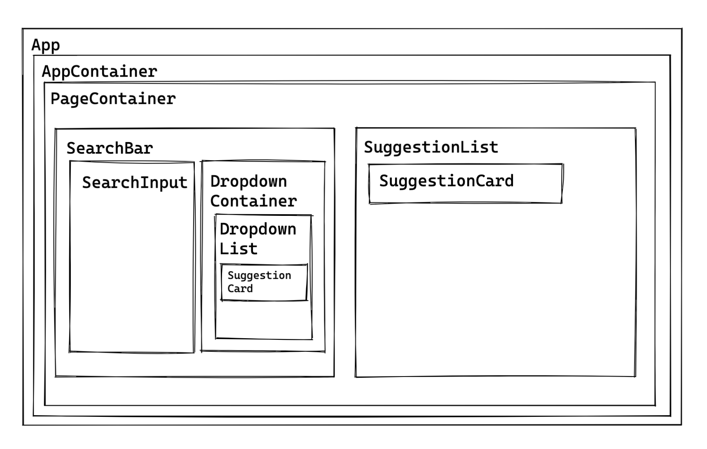
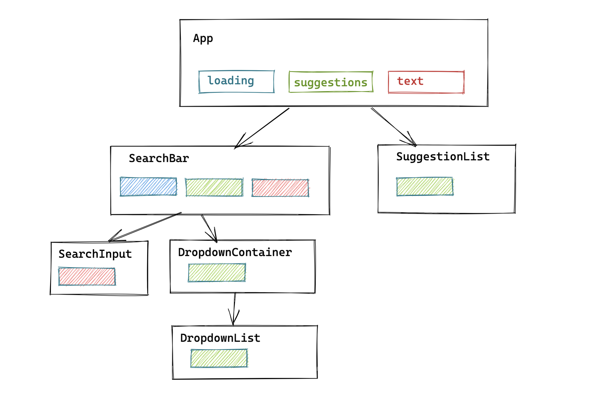

# Music_Search

Write a web app that allows search through a music library and offers a rich and modern UI/UX.

- modern look and feel.
- auto-suggestion based on your input.
- loading indicators of some sorts.
- The entered search term should find results in these three media categories:
**Artist, Album** and **Song**
- In the list of suggestions, there should be ideally three items per media category
(hint: you might have to do three different API queries in order to achieve that)
- The last search result should be displayed with more information below the search bar.
Come up with a meaningful title and description for the result item.
- Display a preview image (conveniently, the API provides a hosted image URL)

## Proposed solution

I followed the bare-bone method
1. Component structure
 
2. State and props
 
3. Functionality 
4. Styling

## Assumptions

- To make it scalable the components were split in that way so every page container could be a different route in the future
- A searchApiClient was created in a singleton pattern, to be reusable, easy to maintain and scalable

## Libraries tools used

- React.js
- Create React App for project setyp
- Styled components
- Typescript

## Setup

To install the dependencies run:

`npm install`

And to run the app:

`npm start`

## Running the tests

You can run the unit tests using:

`npm test`

## Future Work

1. Complete test coverage to achieve 90%
2. Improve the styling and responsive design
3. Test for performance
4. Split the pages into views
5. Make use of the useSearchParams when searching to save the history and improve the performance